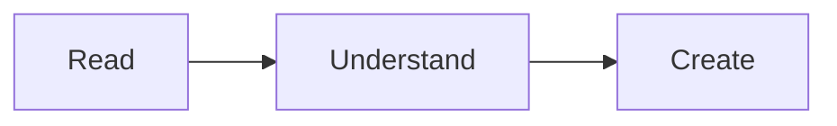
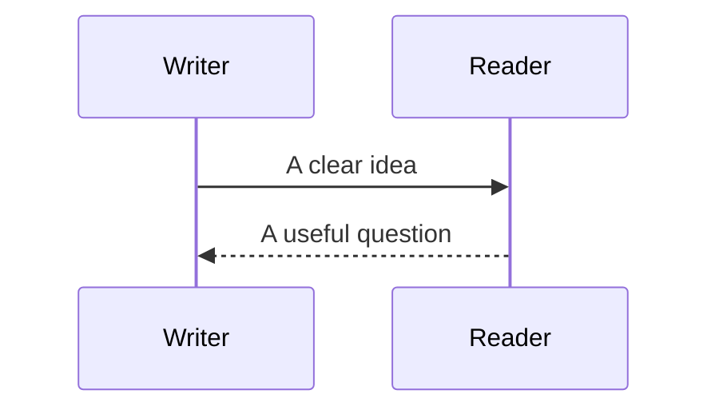

# A page for every kind of text

This document checks **bold**, *italic*, ***both***, ~~strikethrough~~, and ==highlighted writing==. Water is H~2~O; a square metre is m^2^.

## Paragraphs and line breaks

An ordinary paragraph wraps naturally at the edge of the reading column. A single newline
continues the same paragraph.

A deliberate line break ends here.  
The next line starts here.

Backslash break here.\
And here is its next line.

---

## Heading hierarchy

### A third-level heading

Supporting text.

#### A fourth-level heading

Supporting text.

##### A fifth-level heading

Supporting text.

###### A sixth-level heading

Supporting text.

Alternative heading
-------------------

An underlined Markdown heading.

## Lists and tasks

- A first point
- Another point with **emphasis**
  - A nested point
  - Another nested point
    1. A numbered child
    2. Another child

3. An ordered list starting at three
4. A second item

- [x] Read the brief
- [ ] Review the details

## Quotations and callouts

> A quotation deserves room to breathe.
>
> > A quotation within a quotation.

> [!note] A useful note
> A callout with **bold text** and a [link](https://example.com).

> [!tip]+ Open tip
> This callout starts expanded.

> [!warning]- A folded warning
> This callout starts collapsed.

## Tables

| Left | Centred | Right |
| :--- | :---: | ---: |
| Text | **Bold** | 125 |
| Escaped \| pipe | `inline code` | 2,500 |
| A longer entry that can wrap | Middle | 3 |

## Links and references

[An ordinary link](https://example.com), [a reference link][reference], and a plain URL: https://example.com.

[Jump to equations](#equations). [[#Equations|The same jump using a wiki link]]. [[Welcome|Open another local note]].

[reference]: https://example.com "Reference title"

A claim with a footnote.[^evidence] Here it is again.[^evidence]

[^evidence]: The original evidence, with **emphasis** and another paragraph.

    A second paragraph in the footnote.

## Definitions

Typography
: The arrangement of type to make reading clear and comfortable.

Measure
: The width of a line of text.

## Code

Inline `const value = 42` keeps its own voice.

```javascript
// Colour should help without overwhelming the page.
const message = "Hello, reader.";
function greet(name) {
  return `${message} ${name}`;
}
```

```json
{
  "title": "A useful document",
  "offline": true,
  "count": 3
}
```

    Indented code remains code.
    Spaces and tabs survive copying.

~~~unknown-language
Unknown code stays readable: <tag> & text.
~~~

## Equations

An inline equation $E = mc^2$ sits inside a sentence. Prices such as $20 and $30 should remain prices.

$$
\int_0^1 x^2\,dx = \frac{1}{3}
$$

Bracket notation: \(a^2+b^2=c^2\).

```math
\begin{pmatrix}1 & 2 \\ 3 & 4\end{pmatrix}
```

## Diagrams





## Images and embeds


![[assets/dot.png]]

![[Welcome]]

Images require access to this document's folder. Embedded notes open separately; this reader does not resolve a whole Obsidian vault.

## Comments and literal syntax

This sentence has %%a hidden inline comment%% visible words on both sides.

%%
This entire comment should not appear.
%%

Escaped symbols: \*not italic\*, \#not a heading, \[not a link\].

Literal syntax: `==highlight==`, `[[Note]]`, and `%%comment%%`.

Raw HTML is displayed as text: <u>underline</u>.

## Invalid content stays readable

```math
\notARealCommand{example}
```

```mermaid
this is not a diagram
```

## End of formatting check

Nothing after an invalid equation or diagram should disappear.
