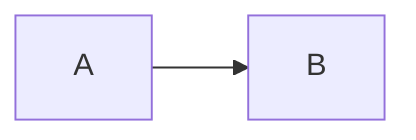

# Research notes

English, Deutsch: Größe, café, 日本語, مرحبا, 👩🏽‍💻.

## Findings

A **strong** result with *emphasis*, ~~old text~~ and a [reference][source].

1. First point
   - Nested item
   - Another item
2. Second point

A hard break here.  
Next line.

A footnote[^evidence] and the same footnote again[^evidence].

## Findings

[Jump to first findings](#findings). [Second](#findings-1).

| Left | Right | Center |
| :--- | ---: | :---: |
| `a\|b` | 42 | **yes** |

$$x^2 + y^2 = z^2$$

[^evidence]: Preserved footnote text.
[source]: https://example.com
