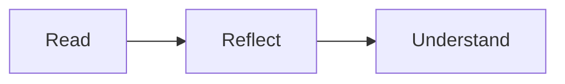

# The art of paying attention

Good reading begins with a little space. A clear page gives every thought room to unfold—and makes the important details easy to find.

## A quieter page

Typography is a relationship between **the shape of a letter**, the length of a line, and the space around it. Bigger text is only the beginning.

> [!tip] A useful distinction
> Keep the main argument in the flow of the page. Use a note for context that helps without interrupting.

### Things worth noticing

- A comfortable line length, even in a wide window.
- Lists with a clear rhythm and room between ideas.
  - Supporting points sit close to the thought they belong to.
  - Nested lists remain easy to follow.
- Links, notes and code each have their own visual treatment.

1. Read the whole thought.
2. Notice what matters.
3. Return to the source when you need more detail.

- [x] Read the introduction
- [ ] Make time for the next chapter

> [!warning]- A note you can open
> Supporting details stay available without taking over the page.

## The details, when you need them

```swift
let thought = "Give the words room."
print(thought)
```



| Element | Purpose |
| :--- | :--- |
| Body text | Follow the thought |
| A note | Add useful context |
| Source | Inspect the exact words |

> Good typography is felt before it is noticed.

A source can sit quietly at the end of a thought.[^note]

[^note]: This is a sample document created to inspect Folio’s typography. It is not a quotation from the research sources.
