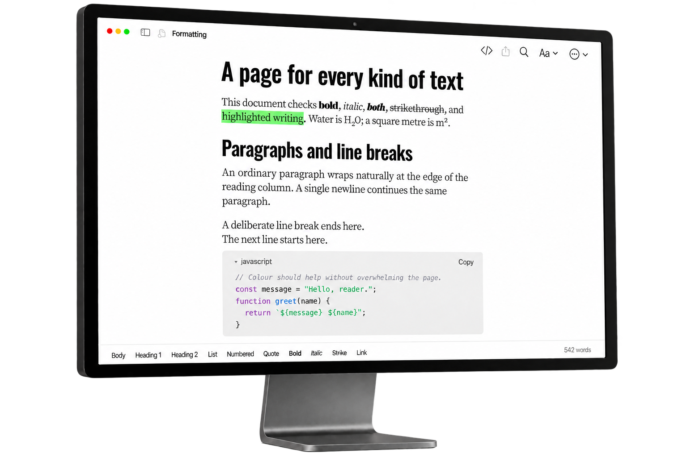
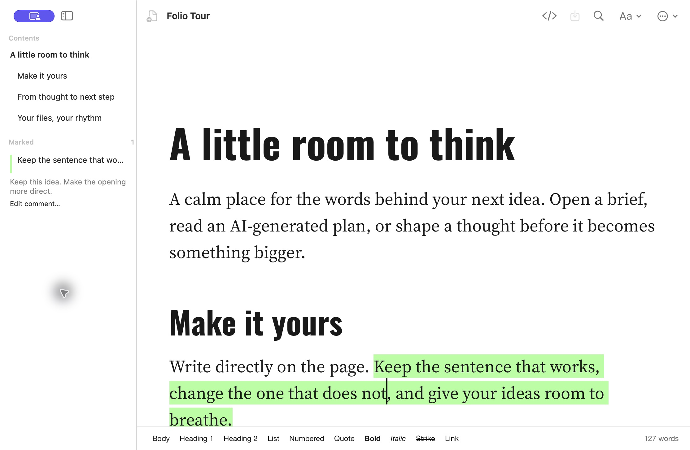
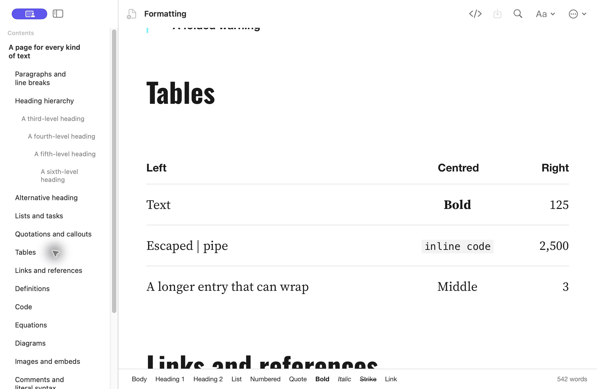
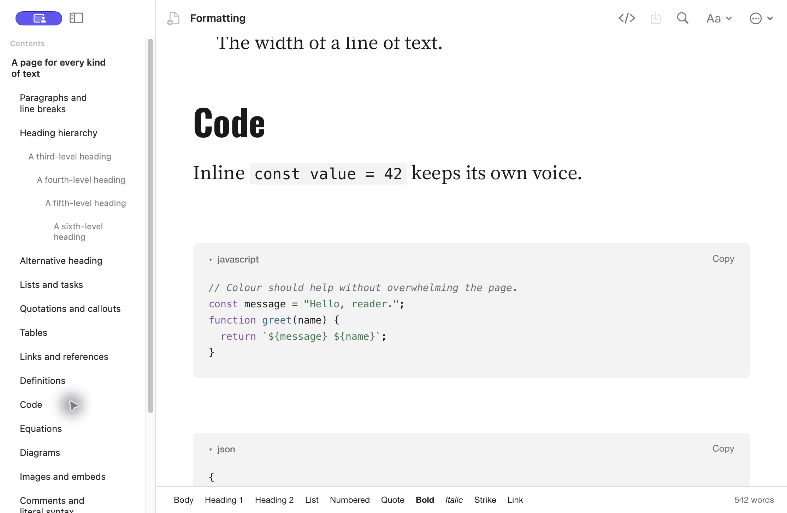

<div align="center">


# Folio

### A beautiful place for your Markdown.

Read the brief. Refine the idea. Highlight what matters.

**[Download for Mac](https://github.com/pippo-wtf/folio/releases/download/v0.13.2/Folio.dmg)** · [Features](#features) · [Installation](#installation)

Apple silicon · macOS 14+ · Free & open source

</div>



## Your next step after the AI draft

The plan from Claude. The notes from Codex. The brief behind your next idea.
Folio gives designers and creatives a comfortable place to read, question and improve them.

Beautiful typography. A clean page. Your own Markdown files.
**No account. No subscription. Works offline.**

## Features

- **Read with room to breathe.** Expressive headings, comfortable serif text and generous spacing, with Folio’s signature Green Line look. Light by day; charcoal, warm text and orange accents after dark.
- **Write where you read.** Activate the pencil to write directly on the page; turn it off to read and highlight. Keep everyday formatting close with the bottom toolbar.
- **Keep what matters.** Save highlights, add comments and jump back to marked passages from the sidebar.
- **See more than plain text.** Render lists, checkboxes, tables, code, callouts, footnotes, equations and diagrams.
- **Go to the source.** Switch to the underlying Markdown whenever you need it.
- **Share something polished.** Export a PDF or copy formatted text into another app.
- **Keep your files yours.** Open and save regular `.md` files. No proprietary library to move into.

## A closer look

**Keep your thinking beside the text.** Saved highlights and comments stay within reach in the Marked sidebar.



<details>
<summary>See tables and code rendering</summary>





</details>

*Enter starts a paragraph. Shift+Enter starts a new line. Edit simple tables, fenced code and local images using their pencil controls. Other complex Markdown remains available in Source.*

## Installation

### Download for Mac

1. **[Download Folio.dmg](https://github.com/pippo-wtf/folio/releases/download/v0.13.2/Folio.dmg).**
2. Open it and launch **Install Folio**. It installs into your personal **Applications** folder.
3. Open Folio and choose a Markdown file.

**All you need is an Apple silicon Mac running macOS 14 or later.**
You don’t need Node.js, Xcode, an AI subscription or another Markdown app to run the download.

Folio is Developer ID signed and Apple-notarized. On first launch, you can choose whether Folio opens your Markdown files by default.

### Install with Homebrew

If you already use [Homebrew](https://brew.sh), install from the Folio tap:

```sh
brew install --cask --appdir="$HOME/Applications" pippo-wtf/tap/folio
```

Homebrew is optional. The direct download is the simplest way to start.

### Updating

Folio shows available updates and release notes. Choose **Update** to download, then **Install & Relaunch** when ready. Nothing installs automatically.
For versions older than 0.13, install the new download once to enable in-app updates.
Your documents and saved preferences stay in place.
For a Homebrew installation, use `brew update` followed by `brew upgrade --cask pippo-wtf/tap/folio`.

## Made by Pippo

Created and maintained by **[Pippo](https://github.com/pippo-wtf)** for designers and creatives who build with AI.

Found something that needs attention? [Report a problem](https://github.com/pippo-wtf/folio/issues).

For building from source and working with the separate configuration edition, see [Development](DEVELOPMENT.md).
These tools are only needed for development, not for using Folio.

Folio is free and open source under the **[MIT License](LICENSE)**.
Bundled fonts and libraries retain their own licenses, included with the app.
